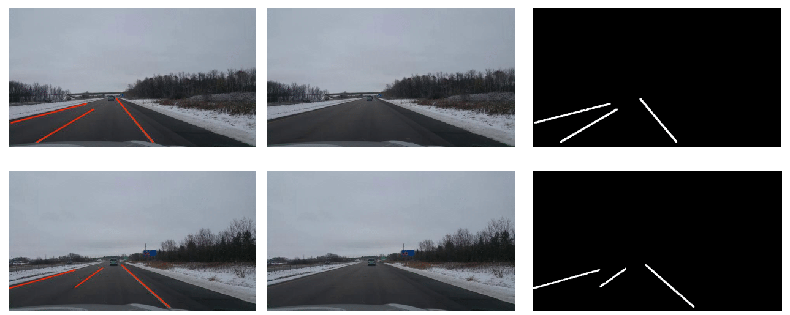

# Lane-Marker-Generation-Using-Transformer-Based-GANs
This repository contains the code for **GLFormer**. 

## Description
Lane segmentation is a crucial component for the proper functioning of a completely autonomous vehicle. Most of the methods that exist right now depend predominantly on the lane markers being clearly visible. This is not always the case as there are challenging scenarios where lane lines have been degraded due to wear and tear, and adverse weather conditions such as snow and even dust. This projects aims to tackle this challenge by taking a generative approach to lane segmentation based on Transformers. To this end, this project proposes an Image-to-Image generative adversarial network comprised of Vision Transformers to predict lane segmentation mask and improve the quality of the generated segmentation mask by incorporating the Embedding Loss. Being able to determine the position of the lane lines based on local and global features in the image would be critical while driving in situation with limited lane line visibility.

## Data
The model was trained on data collected by the IRV Lab at the University of Minnesota. This dataset consists of image data acquired by using a smart phone mounted on a windshield of a car. To simulate poor visibility of lane lines, the images are preprocessed to remove
all the lane markers. Thus, the dataset for this project consists of images of two types: images with lanes removed and the ground truth segmentation map obtained using images with lanes preserved. A sample from the dataset is shown below:

## Output
Here is a sample output from the best performing model.  
  

